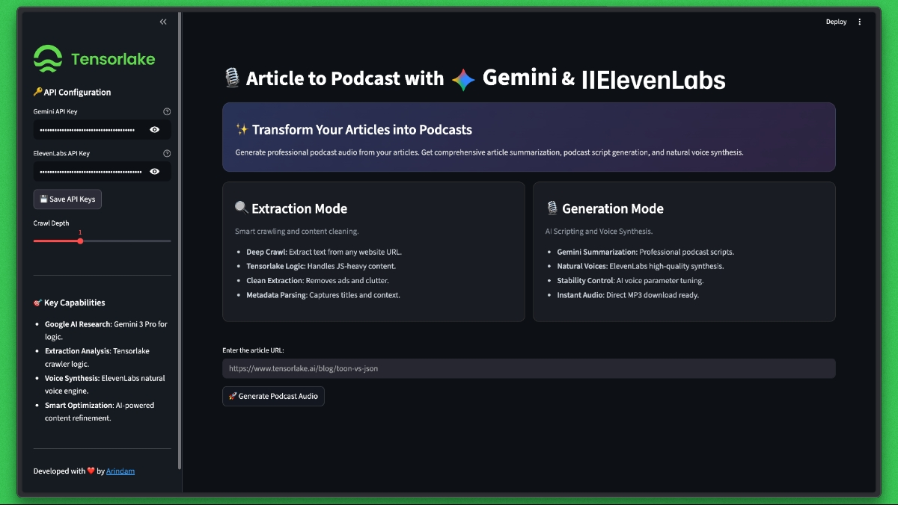

# 🎙️ Article to Podcast Generator

Transform any online article into a professional podcast with AI. This project combines **Tensorlake** for intelligent web scraping, **Gemini 3 Flash** for content summarization, and **ElevenLabs** for natural voice synthesis.

---

## ✨ Features

- **Smart Web Crawling** — Tensorlake extracts clean, readable text from any URL
- **AI Summarization** — Gemini 3 Flash generates engaging podcast-style scripts
- **Natural Voice Synthesis** — ElevenLabs produces high-quality audio output
- **Modern UI** — Beautiful Streamlit interface with dark theme
- **One-Click Generation** — From URL to podcast in seconds

---

## 🔧 How It Works

1. **Crawl & Extract** — Tensorlake fetches the article and strips away ads, navigation, and clutter
2. **Summarize** — Gemini 3 Flash transforms the content into a conversational podcast script
3. **Synthesize** — ElevenLabs converts the script into natural-sounding audio
4. **Download** — Listen in-browser or download the MP3

---

## 📁 Project Structure

| File           | Description                                              |
| -------------- | -------------------------------------------------------- |
| `app.py`       | Streamlit app — runs the full pipeline from URL to audio |
| `main.py`      | Tensorlake web scraper and text extraction logic         |
| `summarize.py` | Gemini summarization module                              |
| `audio.py`     | ElevenLabs text-to-speech conversion                     |
| `.env`         | API keys (Gemini + ElevenLabs)                           |

---

## 🚀 Quick Start

### Prerequisites

- Python 3.10+
- [Gemini API Key](https://aistudio.google.com/app/apikey)
- [ElevenLabs API Key](https://elevenlabs.io/)

### Installation

```bash
# Clone the repo
git clone https://github.com/Studio1hq/PodcastGenerator.git
cd PodcastGenerator

# Create virtual environment
python -m venv venv
source venv/bin/activate  # Windows: venv\Scripts\activate

# Install dependencies
pip install -r requirements.txt
```

### Configuration

Create a `.env` file in the project root:

```env
GEMINI_API_KEY=your_gemini_api_key
ELEVENLABS_API_KEY=your_elevenlabs_api_key
```

### Run

```bash
streamlit run app.py
```

Then open [http://localhost:8501](http://localhost:8501) in your browser.

---

## 📦 Dependencies

```
tensorlake
pydoll-python
streamlit
google-genai
requests
python-dotenv
```

---

## 🎯 Usage

1. Enter an article URL
2. Configure your API keys in the sidebar (or use `.env`)
3. Adjust crawl depth if needed
4. Click **Generate Podcast Audio**
5. Listen to the result or download the MP3

---

## 📄 License

MIT

---

<p align="center">
  Developed with ❤️ by <a href="https://github.com/arindam">Arindam</a>
</p>
